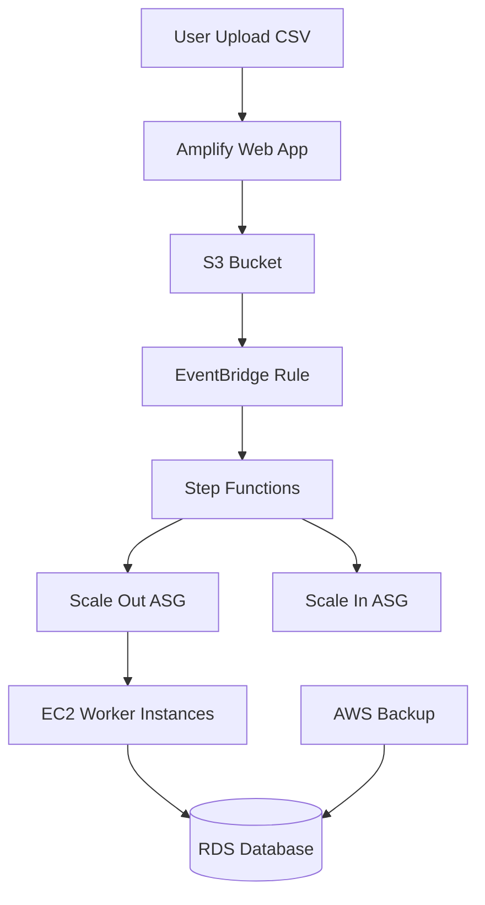

## Batch Student Score Processing System (Auto Scaling Based)

A school wants to build a cloud-based system to process student exam scores efficiently.

### Requirements:

1. Users upload a CSV file containing student scores via a web application.
2. The file is stored in **Amazon S3**.
3. When a file is uploaded:
   * A workflow is triggered using **Amazon EventBridge**
   * The workflow is orchestrated by **AWS Step Functions**
4. The system must:
   * Automatically scale EC2 worker instances using **Auto Scaling Group**
   * Process the CSV file using EC2 instances
   * Store processed results into **Amazon RDS**
5. After processing:
   * EC2 instances must terminate automatically
6. Database must be backed up using **AWS Backup**

---

# 🎯 TASKS

Participants must:

1. Create S3 bucket for file upload
2. Create RDS database and schema
3. Create EC2 Launch Template with user data script
4. Create Auto Scaling Group (min=0, max=3)
5. Create Step Functions to control scaling
6. Create EventBridge rule triggered by S3 upload
7. Deploy frontend using Amplify
8. Test system end-to-end

---

# 📁 LOCAL PROJECT STRUCTURE

```bash
lks-ec2-batch-processing/
│
├── frontend/
│   └── index.html
│
├── ec2/
│   └── process.py
│
├── stepfunctions/
│   └── state_machine.json
│
├── database/
│   └── schema.sql
│
└── sample-data/
    └── scores.csv
```

---

# 🚀 LKS Cloud Computing 2026

## Batch Student Score Processing System (EC2 + Auto Scaling + Step Functions)

---

## 📌 Overview

This project implements a **cloud-based batch processing system** for student exam scores using AWS services.

The system is designed with a **scalable, event-driven architecture** using:

* Amazon S3 (file storage)
* Amazon EC2 (processing engine)
* Auto Scaling Group (compute scaling)
* AWS Step Functions (orchestration)
* Amazon EventBridge (event trigger)
* Amazon RDS (database)
* AWS Amplify (frontend)
* AWS Backup (data protection)

---

## 🧠 Architecture Diagram



---

## 🔄 System Workflow

1. User uploads CSV file via web (Amplify)
2. File is stored in S3
3. S3 triggers EventBridge
4. EventBridge triggers Step Functions
5. Step Functions:

   * Scale OUT EC2 instances (ASG)
   * Wait for processing
   * Scale IN EC2 instances
6. EC2 instances:

   * Download file from S3
   * Process CSV
   * Store results in RDS
   * Shutdown automatically
7. AWS Backup protects database

---

## 📁 Project Structure

```
lks-ec2-batch-processing/
│
├── frontend/
│   └── index.html
│
├── ec2/
│   └── process.py
│
├── stepfunctions/
│   └── state_machine.json
│
├── database/
│   └── schema.sql
│
└── sample-data/
    └── scores.csv
```

---

## ⚙️ Step-by-Step Setup

---

### 1️⃣ Create S3 Bucket

* Go to AWS S3
* Create bucket:

  ```
  student-score-bucket
  ```
* Keep default settings

---

### 2️⃣ Setup RDS Database

* Engine: PostgreSQL
* Instance: `db.t3.micro`
* Public access: YES (for testing)

#### Run SQL Schema


---

### 3️⃣ Create IAM Role for EC2

Attach policies:

* AmazonS3FullAccess
* AmazonRDSFullAccess (or custom minimal access)

---

### 4️⃣ Create EC2 Launch Template

Go to EC2 → Launch Templates

#### Configuration:

* AMI: Ubuntu 22.04
* Instance type: t2.micro
* IAM Role: attach role created above

---

### Add User Data Script


---

### 5️⃣ Create Auto Scaling Group (ASG)

* Name: `worker-asg`
* Launch template: `worker-template`

#### Settings:

```
Min: 0
Max: 3
Desired: 0
```

---

### 6️⃣ Create Step Functions

Upload file:

```
stepfunctions/state_machine.json
```

#### Replace:

```
worker-asg → your ASG name
```

---

### 7️⃣ Configure EventBridge

#### Rule:

* Event source:

```
aws.s3
```

#### Event pattern:

```json
{
  "source": ["aws.s3"],
  "detail-type": ["Object Created"]
}
```

#### Target:

```
Step Functions
```

---

### 8️⃣ Deploy Frontend (Amplify)

* Upload `frontend/index.html`
* Replace:

```
YOUR_PRESIGNED_URL
```

with actual presigned URL logic (or backend)

---

### 9️⃣ Configure AWS Backup

* Backup plan:

  * Daily
  * Retention: 7 days
* Resource: RDS

---

## 🧪 Testing

Upload file:

```
sample-data/scores.csv
```

### Expected Result:

* EC2 instances start automatically
* Data processed and inserted into RDS
* EC2 instances shut down
* ASG scales back to 0

---

# 🧪 END-TO-END FLOW

```text
User uploads CSV
→ S3
→ EventBridge triggered
→ Step Functions starts
→ ASG scale out
→ EC2 instances launch
→ process.py runs automatically
→ Data inserted into RDS
→ EC2 shuts down
→ Step Functions scale in
```
