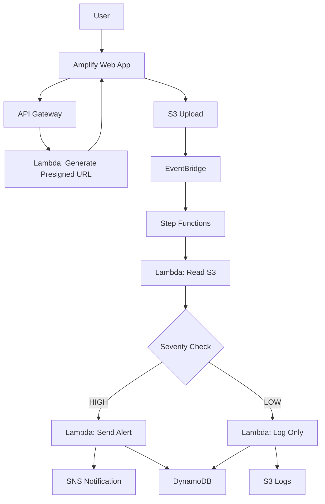

# 🚀 Event-Driven Incident Processing System (Serverless AWS)

---

## 📌 Overview

This project implements a **fully serverless, event-driven incident processing system** using AWS.

Users upload incident data via a web interface, and the system automatically:

1. Stores the file in S3
2. Triggers a workflow using EventBridge
3. Processes the incident using Step Functions
4. Sends alerts for high-severity incidents
5. Stores results in DynamoDB

---

## 🧠 Architecture



---

## 🔄 Workflow

1. User uploads JSON file via frontend
2. API Gateway generates a presigned S3 upload URL
3. File is uploaded directly to S3
4. S3 triggers EventBridge
5. EventBridge starts Step Functions
6. Step Functions:

   * Reads file from S3
   * Checks severity
   * Sends alert (if HIGH)
   * Logs data
   * Saves to DynamoDB

---

## 📁 Project Structure

```bash
incident-system/
│
├── frontend/
│   └── index.html
│
├── lambda/
│   ├── generate_url.py
│   ├── read_s3.py
│   ├── alert.py
│   ├── log.py
│   └── save.py
│
├── stepfunctions/
│   └── state_machine.json
│
└── sample-event.json
```

---

## 💻 Lambda Functions

---

### 1️⃣ Generate Presigned URL

📄 `lambda/generate_url.py`

---

### 2️⃣ Read File from S3

📄 `lambda/read_s3.py`


### 3️⃣ Send Alert (SNS)

📄 `lambda/alert.py`


---

### 4️⃣ Log to S3

📄 `lambda/log.py`


---

### 5️⃣ Save to DynamoDB

📄 `lambda/save.py`


## 🧩 Step Functions

📄 `stepfunctions/state_machine.json`


---

## 🌐 Frontend (Amplify)

📄 `frontend/index.html`


## ⚙️ Setup Guide

---

### 1️⃣ Create S3 Buckets

```text
incident-input-bucket
incident-logs
```

Enable:

```
Send notifications to EventBridge
```

---

### 2️⃣ Create DynamoDB

```text
Table: incident-table
Partition key: id
```

---

### 3️⃣ Create SNS

* Create topic
* Subscribe email

---

### 4️⃣ Create Lambda Functions

Upload all scripts

Add IAM permissions:

```
S3FullAccess
SNSFullAccess
DynamoDBFullAccess
```

---

### 5️⃣ Create API Gateway

* HTTP API
* Route:

```
GET /generate-url
```

* Integration:

```
Lambda → generate_url
```

Enable CORS

---

### 6️⃣ Create Step Functions

* Paste JSON
* Replace Lambda ARNs

---

### 7️⃣ Create EventBridge Rule

Event pattern:

```json
{
  "source": ["aws.s3"],
  "detail-type": ["Object Created"],
  "detail": {
    "bucket": {
      "name": ["incident-input-bucket"]
    }
  }
}
```

Target:

```
Step Functions
```

---

### 8️⃣ Deploy Frontend

* Upload to Amplify
* Replace API URL

---

## 🧪 Testing

Upload:

sample_event.json

---

## 🎯 Expected Flow

```
Upload file
→ S3
→ EventBridge
→ Step Functions
→ Read S3
→ Branch (HIGH/LOW)
→ Alert / Log
→ Save to DynamoDB
```

---

## ⚠️ Common Issues

* EventBridge not enabled in S3
* Wrong bucket name in rule
* Lambda missing permissions
* Invalid JSON format

---

## 🏁 Conclusion

This project demonstrates a **real-world event-driven architecture** using AWS serverless services, suitable for:

* LKS Cloud Computing competition
* Portfolio projects
* Learning advanced cloud patterns

---
