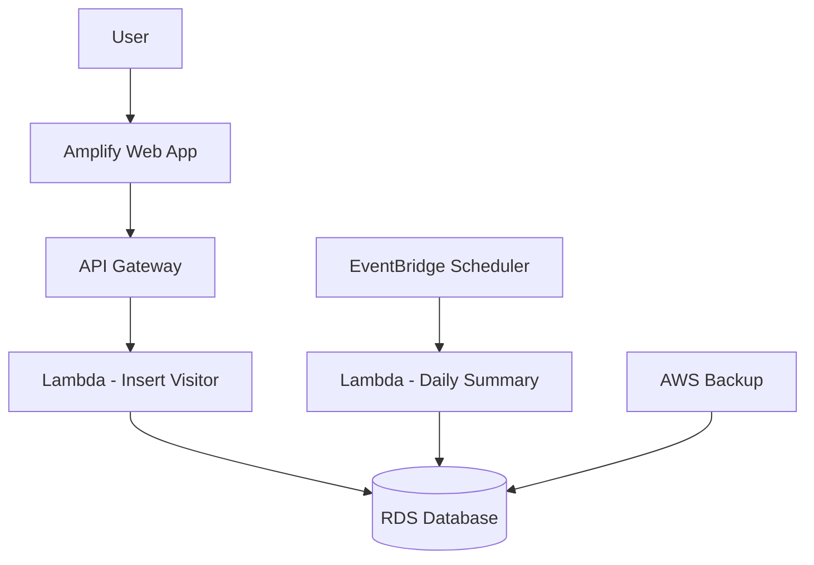

# 📚 Library Visitor App (AWS Serverless)

## 🚀 Overview

This project is a **serverless web application** to record and process library visitors using AWS services.

The system is built with:

* AWS Amplify (Frontend Hosting)
* Amazon API Gateway (API Endpoint)
* AWS Lambda (Backend Logic)
* Amazon RDS (Database)
* Amazon EventBridge (Scheduled Jobs)
* AWS Backup (Database Backup)

---

## 🧠 Architecture



---

## 🔄 Workflow

1. User submits visitor form from web
2. Request sent to API Gateway
3. API Gateway triggers Lambda
4. Lambda inserts data into RDS
5. EventBridge runs daily job:

   * Calculate total visitors
   * Store summary
6. AWS Backup automatically backs up database

---

## 📁 Project Structure

```bash
library_visitor_app/
│
├── frontend/
│   └── index.html
│
├── lambda/
│   ├── insert_visitor.py
│   └── daily_summary.py
│
├── database/
│   └── schema.sql
│
└── README.md
```

---

## ⚙️ Setup Guide (Step-by-Step)

---

### 1️⃣ Create RDS Database

1. Go to AWS RDS

2. Create database:

   * Engine: MySQL
   * Template: Free Tier
   * Instance: db.t3.micro

3. Enable:

   * Public Access = YES

4. Configure Security Group:

   ```
   Port: 3306
   Source: 0.0.0.0/0 (for testing only)
   ```

---

### 2️⃣ Create Database Tables

Run SQL:

```sql
CREATE TABLE visitors (
    id INT AUTO_INCREMENT PRIMARY KEY,
    name VARCHAR(100),
    class VARCHAR(20),
    purpose VARCHAR(255),
    visit_time TIMESTAMP DEFAULT CURRENT_TIMESTAMP
);

CREATE TABLE daily_summary (
    id INT AUTO_INCREMENT PRIMARY KEY,
    date DATE,
    total_visitors INT
);
```

---

### 3️⃣ Create Lambda Functions

Create 2 Lambda functions:

* `insert-visitor`
* `daily-summary`

Runtime:

```
Python 3.11
```

---

### 4️⃣ Install Dependencies (pymysql)

Lambda requires MySQL driver:

```bash
pip install pymysql -t .
zip -r function.zip .
```

Upload to Lambda.

---

### 5️⃣ Set Environment Variables

In Lambda:

```
DB_HOST=your-rds-endpoint
DB_NAME=your-database-name
DB_USER=admin
DB_PASS=password123
```

---

### 6️⃣ Create API Gateway

1. Create HTTP API
2. Create route:

```
POST /visitor
```

3. Integration:

```
Lambda → insert-visitor
```

4. Enable CORS

---

### 7️⃣ Deploy Frontend (Amplify)

1. Go to Amplify
2. Host web app
3. Upload `frontend/index.html`

Update API URL:

```javascript
const API_URL = "YOUR_API_GATEWAY_URL";
```

---

### 8️⃣ Setup EventBridge (Scheduler)

Create rule:

```
cron(*/5 * * * ? *)
```

Target:

```
Lambda → daily-summary
```

---

### 9️⃣ Setup AWS Backup

1. Create Backup Plan
2. Configuration:

   * Frequency: Daily
   * Retention: 7 days
3. Assign resource:

   * RDS instance

---

## 🧪 Testing

### Test API (using Postman)

Example request:

```json
{
  "name": "Budi",
  "class": "10A",
  "purpose": "Reading"
}
```

Expected result:

* Data inserted into RDS
* Daily summary created automatically
