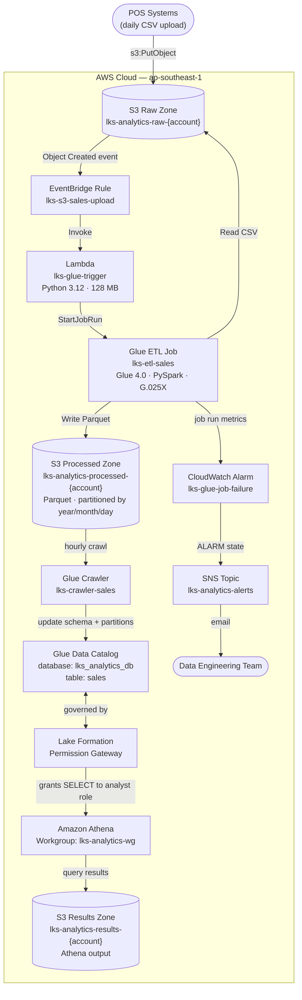

# Module: Serverless Data Analytics Pipeline

**Duration: 4 Hours – S3 Data Lake · Glue ETL · Lake Formation · Athena**

> **Free Tier Notice**: S3, Lambda, EventBridge, CloudWatch (basic), and SNS are covered under the AWS Free Tier. Glue ETL (G.025X, ~$0.004/run), Glue Crawler (~$0.01/run), and Athena ($5/TB scanned, ~$0.001 on test data) incur tiny costs. Shut down the Glue crawler schedule when not practicing. Total expected cost for one full test run: **< $0.05**.

---

## Description of Project and Tasks

You are working as a **Data Engineer** at **PT. Nusantara Retail Analytics**, a retail chain operating 50+ stores across Indonesia. Every day each store's Point-of-Sale (POS) system exports a CSV file of transactions and uploads it to a central storage location.

Currently, the analytics team downloads these CSVs manually, cleans them in Excel, and runs reports once a week. The Head of Data wants to modernize by building a **fully serverless, event-driven data pipeline**: the moment a CSV file lands in S3 it should automatically be transformed into an optimized Parquet format, catalogued, and made queryable in seconds via SQL — with no servers to manage.

The solution must enforce **fine-grained data access control** through AWS Lake Formation so that analysts can only query the tables explicitly granted to them, not browse all of S3 directly. All pipeline failures must trigger an email alert to the data engineering team.

---

## Architecture



---

## Tasks

1. Read this entire document before starting
2. Set up S3 buckets (raw, processed, results) — see **S3** section
3. Create IAM roles (Glue, Lambda, Athena analyst) — see **IAM Roles** section
4. Upload Glue ETL script and create the Glue ETL job + Crawler — see **Glue** section
5. Configure Lake Formation (register bucket, grant permissions) — see **Lake Formation** section
6. Create the Lambda trigger function and EventBridge rule — see **Lambda & EventBridge** section
7. Configure Athena workgroup — see **Athena** section
8. Set up monitoring (CloudWatch alarm + SNS email alert) — see **Monitoring** section
9. Validate the end-to-end pipeline — see **Validation** section

---

## Technical Details

- Default region: **ap-southeast-1 (Singapore)**
- All manually created IAM Roles must be prefixed **`LKS-`**
- Tag every resource you create:

  | Tag Key | Value |
  |---|---|
  | `Project` | `nusantara-analytics` |
  | `Environment` | `production` |
  | `ManagedBy` | `LKS-Team` |

---

## Service Details

### S3

Three buckets, all in `ap-southeast-1` with SSE-S3 encryption and public access blocked:

| Bucket | Purpose | Versioning |
|---|---|---|
| `lks-analytics-raw-{ACCOUNT_ID}` | Landing zone for raw CSV files from POS | Enabled |
| `lks-analytics-processed-{ACCOUNT_ID}` | Glue ETL output (Parquet, partitioned) + ETL script | Enabled |
| `lks-analytics-results-{ACCOUNT_ID}` | Athena query result output | Disabled |

**Key prefixes:**

| Bucket | Prefix | Contents |
|---|---|---|
| raw | `data/sales/YYYY/MM/DD/` | CSV files from POS stores |
| processed | `scripts/` | Glue ETL Python script |
| processed | `sales/year=YYYY/month=MM/day=DD/` | Parquet output (Hive-partitioned) |

**Enable EventBridge notifications** on the raw bucket (required so S3 events flow to EventBridge):
- S3 Console → raw bucket → Properties → Event notifications → Amazon EventBridge → **On**

> Free Tier: 5 GB storage, 20K GET, 2K PUT per month for 12 months. ✓

---

### IAM Roles

| Role Name | Trusted By | Purpose |
|---|---|---|
| `LKS-GlueETLRole` | `glue.amazonaws.com` | Runs the ETL job and Crawler |
| `LKS-LambdaGlueTriggerRole` | `lambda.amazonaws.com` | Invokes Glue job from Lambda |
| `LKS-AthenaAnalystRole` | IAM account root | Used by analyst to query via Athena |

`LKS-GlueETLRole` must have:
- Inline policy: `LKS-GlueETLPolicy` (see `iam/glue-role-policy.json`)
- Managed policy: `arn:aws:iam::aws:policy/service-role/AWSGlueServiceRole`

`LKS-LambdaGlueTriggerRole` must have:
- Inline policy: `LKS-LambdaGlueTriggerPolicy` (see `iam/lambda-role-policy.json`)
- Managed policy: `arn:aws:iam::aws:policy/service-role/AWSLambdaBasicExecutionRole`

`LKS-AthenaAnalystRole` must have:
- Inline policy: `LKS-AthenaAnalystPolicy` (see `iam/athena-analyst-policy.json`)

---

### Glue

#### ETL Job

| Property | Value |
|---|---|
| Job name | `lks-etl-sales` |
| Type | Spark (Glue ETL) |
| Glue version | `4.0` |
| Worker type | `G.025X` ⚠️ cheapest Spark worker |
| Number of workers | `2` (minimum for Spark) |
| Timeout | `10` minutes |
| IAM role | `LKS-GlueETLRole` |
| Script location | `s3://lks-analytics-processed-{account}/scripts/etl_job.py` |
| Python version | `3` |

Job arguments (default — Lambda overrides `--S3_RAW_PATH` per run):

| Argument | Value |
|---|---|
| `--job-language` | `python` |
| `--enable-metrics` | `true` |
| `--enable-continuous-cloudwatch-log` | `true` |
| `--S3_PROCESSED_BUCKET` | `lks-analytics-processed-{ACCOUNT_ID}` |
| `--S3_PROCESSED_PREFIX` | `sales` |
| `--S3_RAW_PATH` | *(empty — passed per invocation)* |

**What the ETL job does:**
1. Reads the CSV from `--S3_RAW_PATH`
2. Normalizes column names (lowercase, underscores)
3. Drops rows with null `transaction_id`, `sale_date`, or `amount`
4. Casts `amount` → `double`, `quantity` → `int`, `sale_date` → `date`
5. Lowercases `category` and trims `product_name`
6. Adds partition columns: `year`, `month` (zero-padded), `day` (zero-padded)
7. Writes Parquet to `s3://lks-analytics-processed-{account}/sales/` partitioned by `year/month/day`

#### Glue Crawler

| Property | Value |
|---|---|
| Crawler name | `lks-crawler-sales` |
| IAM role | `LKS-GlueETLRole` |
| Data source | `s3://lks-analytics-processed-{account}/sales/` |
| Target database | `lks_analytics_db` |
| Table prefix | *(none)* |
| Schedule | `cron(0 * * * ? *)` — every hour |
| Configuration | `CombineCompatibleSchemas` grouping policy |

#### Glue Data Catalog Database

| Property | Value |
|---|---|
| Database name | `lks_analytics_db` |
| Description | `Nusantara Retail Analytics data lake` |

---

### Lake Formation

Lake Formation acts as the **permission gateway** in front of the Glue Data Catalog. Even if an IAM role has `glue:GetTable`, it cannot read the data unless Lake Formation also grants it.

**Steps (in order):**

1. **Set LF administrator**: Go to Lake Formation console → Administration → Add yourself (current IAM user/role) as a Data Lake Administrator
2. **Disable IAM default permissions**: Under Administration → Data Catalog settings → uncheck both *"Use only IAM access control..."* checkboxes so Lake Formation governs access
3. **Register S3 processed bucket**: Lake Formation → Data lake locations → Register location → `s3://lks-analytics-processed-{account}` → Service-linked role
4. **Grant Glue role permissions**:

   | Principal | Resource | Permissions |
   |---|---|---|
   | `LKS-GlueETLRole` | Database `lks_analytics_db` | `CREATE_TABLE`, `DESCRIBE` |
   | `LKS-GlueETLRole` | Data location `s3://lks-analytics-processed-{account}/` | `DATA_LOCATION_ACCESS` |
   | `LKS-AthenaAnalystRole` | Database `lks_analytics_db` | `DESCRIBE` |
   | `LKS-AthenaAnalystRole` | Table `lks_analytics_db.sales` (all columns) | `SELECT`, `DESCRIBE` |

---

### Lambda & EventBridge

#### Lambda Function

| Property | Value |
|---|---|
| Function name | `lks-glue-trigger` |
| Runtime | Python 3.12 |
| Memory | 128 MB |
| Timeout | 60 seconds |
| IAM role | `LKS-LambdaGlueTriggerRole` |

Environment variables:

| Key | Value |
|---|---|
| `GLUE_JOB_NAME` | `lks-etl-sales` |
| `S3_PROCESSED_BUCKET` | `lks-analytics-processed-{ACCOUNT_ID}` |
| `S3_PROCESSED_PREFIX` | `sales` |

The Lambda function (see `lambda/trigger_glue.py`):
- Parses the EventBridge event to extract bucket name and object key
- Skips non-`.csv` files and files outside `data/sales/` prefix
- Calls `glue:StartJobRun` passing `--S3_RAW_PATH` as the specific file path

#### EventBridge Rule

| Property | Value |
|---|---|
| Rule name | `lks-s3-sales-upload` |
| Event bus | default |
| Event pattern | see below |
| Target | Lambda function `lks-glue-trigger` |

Event pattern:
```json
{
  "source": ["aws.s3"],
  "detail-type": ["Object Created"],
  "detail": {
    "bucket": {
      "name": ["lks-analytics-raw-{ACCOUNT_ID}"]
    },
    "object": {
      "key": [{"prefix": "data/sales/"}]
    }
  }
}
```

---

### Athena

| Property | Value |
|---|---|
| Workgroup name | `lks-analytics-wg` |
| Query result location | `s3://lks-analytics-results-{ACCOUNT_ID}/` |
| Encrypt results | SSE_S3 |
| Enforce result location | Yes (prevent overrides) |

Tag the workgroup:
```
Project=nusantara-analytics, Environment=production, ManagedBy=LKS-Team
```

Example queries to run during validation:

```sql
-- Verify table and partitions
SHOW PARTITIONS lks_analytics_db.sales;

-- Total sales by store
SELECT store_id,
       SUM(amount)    AS total_revenue,
       COUNT(*)       AS transaction_count
FROM lks_analytics_db.sales
WHERE year = '2024' AND month = '01'
GROUP BY store_id
ORDER BY total_revenue DESC;

-- Revenue by product category
SELECT category,
       SUM(amount)    AS revenue,
       SUM(quantity)  AS units_sold
FROM lks_analytics_db.sales
GROUP BY category
ORDER BY revenue DESC
LIMIT 10;

-- Payment method breakdown
SELECT payment_method, COUNT(*) AS count, SUM(amount) AS total
FROM lks_analytics_db.sales
GROUP BY payment_method;
```

---

### Monitoring

| Resource | Property | Value |
|---|---|---|
| SNS Topic | Name | `lks-analytics-alerts` |
| SNS Topic | Subscription | Email — your address |
| CloudWatch Alarm | Name | `lks-glue-job-failure` |
| CloudWatch Alarm | Metric | `Glue > glue.driver.aggregate.numFailedTasks` |
| CloudWatch Alarm | Namespace | `Glue` |
| CloudWatch Alarm | Metric name | `glue.driver.aggregate.numFailedTasks` |
| CloudWatch Alarm | Dimension | `JobName = lks-etl-sales` |
| CloudWatch Alarm | Threshold | `>= 1` for 1 consecutive period (5 min) |
| CloudWatch Alarm | Action | SNS → `lks-analytics-alerts` |

> Alternatively use the built-in Glue job notification: Job → Edit → Job bookmark + notifications → notify on job failure.

---

## Validation

Run `scripts/06-validate.sh` **or** follow these steps manually:

**Step 1 — Upload sample data and watch the pipeline:**
```bash
ACCOUNT_ID=$(aws sts get-caller-identity --query Account --output text)
aws s3 cp data/sample_sales.csv \
  s3://lks-analytics-raw-${ACCOUNT_ID}/data/sales/2024/01/15/sample_sales.csv
```

**Step 2 — Verify Lambda was invoked:**
```bash
aws logs tail /aws/lambda/lks-glue-trigger --since 5m
```

**Step 3 — Check Glue job ran:**
```bash
aws glue get-job-runs \
  --job-name lks-etl-sales \
  --region ap-southeast-1 \
  --query 'JobRuns[0].{State:JobRunState,Started:StartedOn,Duration:ExecutionTime}'
```

**Step 4 — Verify Parquet output in S3:**
```bash
aws s3 ls s3://lks-analytics-processed-${ACCOUNT_ID}/sales/ --recursive
```

**Step 5 — Run Glue Crawler manually:**
```bash
aws glue start-crawler --name lks-crawler-sales --region ap-southeast-1
# Wait ~1 min, then check:
aws glue get-table --database-name lks_analytics_db --name sales --region ap-southeast-1
```

**Step 6 — Query with Athena (as analyst role):**
- Open Athena console → select workgroup `lks-analytics-wg`
- Run the validation queries from the **Athena** section above
- Confirm results return rows from the sample data

> **Bonus**: Deploy an AWS QuickSight analysis connected to Athena `lks-analytics-wg` to visualize revenue by store and category.

---

## Files

```
lks-analytics-pipeline/
├── README.md                           ← This file (exam question)
├── jawaban.md                          ← Step-by-step answer key
├── data/
│   └── sample_sales.csv               ← 10-row test dataset
├── glue/
│   └── etl_job.py                     ← PySpark ETL (Glue 4.0)
├── lambda/
│   └── trigger_glue.py                ← Lambda handler
├── iam/
│   ├── glue-role-trust.json           ← Trust policy for LKS-GlueETLRole
│   ├── glue-role-policy.json          ← Inline policy for LKS-GlueETLRole
│   ├── lambda-role-policy.json        ← Inline policy for LKS-LambdaGlueTriggerRole
│   └── athena-analyst-policy.json     ← Inline policy for LKS-AthenaAnalystRole
└── scripts/
    ├── 01-setup-s3.sh                 ← Create buckets + upload script + sample data
    ├── 02-setup-glue.sh               ← IAM role + Glue job + Glue Crawler
    ├── 03-setup-lakeformation.sh      ← LF admin + register bucket + grant permissions
    ├── 04-setup-athena.sh             ← Athena workgroup
    ├── 05-setup-lambda.sh             ← Lambda function + EventBridge rule
    └── 06-validate.sh                 ← End-to-end pipeline validation
```

---

*Good luck — manage your time wisely!*
