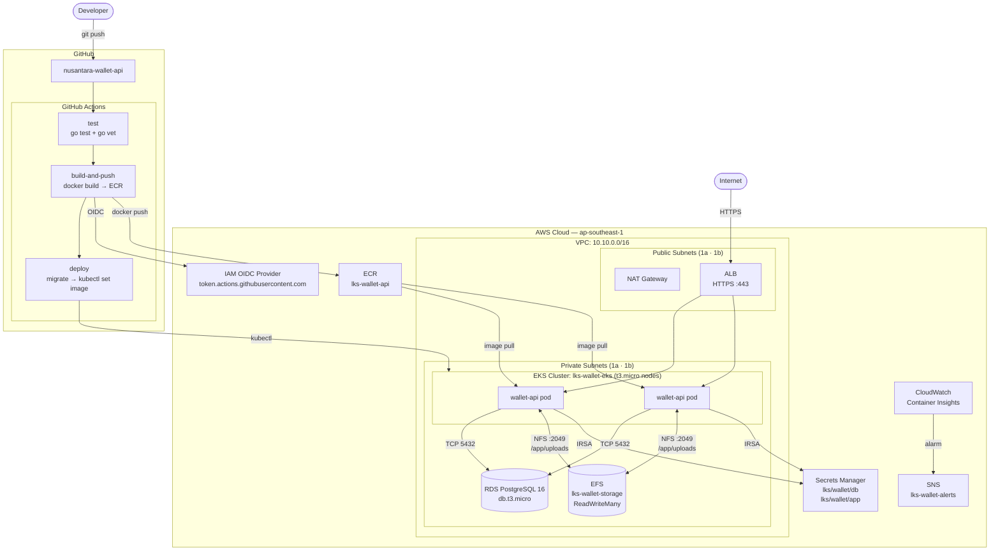

# Module: CI/CD and Container Orchestration

**Duration: 5 Hours – Infrastructure, EKS, CI/CD Pipeline, and Shared File Storage**

> **Free Tier Notice**: This module is designed to stay within the AWS Free Tier where possible. Services marked ⚠️ carry a small cost outside the free tier (EKS control plane ~$0.10/hr, NAT Gateway ~$0.045/hr, ALB ~$0.008/hr). Shut down all resources when not practicing.

---

## Description of Project and Tasks

You are working as a **Cloud Infrastructure Engineer** at **PT. Nusantara FinTech Solutions**, a growing fintech startup providing digital payment and wallet services across Indonesia. The company currently runs its backend API on EC2 Auto Scaling Groups and struggles with slow deployments, environment inconsistencies, and no automated rollback.

The CTO has decided to modernize by **containerizing the API and deploying it on Amazon EKS**, with a fully automated **CI/CD pipeline using GitHub Actions**. The goal: a single `git push` to `main` automatically builds, tests, and deploys to production with zero-downtime rolling updates.

Additionally, users can **upload payment proof documents**. Because multiple pods must read and write these files simultaneously, they will be stored on **Amazon EFS** — a POSIX-compatible shared file system that supports `ReadWriteMany`, something EBS cannot do.

---

## Architecture



---

## Tasks

1. Login to AWS Academy or AWS Professional Account
2. Read this entire document before starting
3. Set up VPC and network — see **Network** section
4. Set up RDS — see **Database** section
5. Set up AWS Secrets Manager — see **Secrets** section
6. Set up ECR — see **Container Repository** section
7. Set up Amazon EFS — see **File System** section
8. Create the EKS Cluster — see **EKS Cluster** section
9. Install EKS add-ons **in order** — see **EKS Add-ons** section
10. Configure GitHub Actions — see **CI/CD Pipeline** section
11. Deploy the application — see **Deployment** section
12. Configure autoscaling — see **Autoscaling** section
13. Set up monitoring — see **Monitoring** section
14. Validate end-to-end — see **Validation** section

---

## Technical Details

- Default region: **ap-southeast-1 (Singapore)**
- All manually created IAM Roles must be prefixed **`LKS-`**
- Tag every resource you create:

  | Tag Key | Value |
  |---|---|
  | `Project` | `nusantara-wallet` |
  | `Environment` | `production` |
  | `ManagedBy` | `LKS-Team` |

- Auto-generated EKS resources (ENIs, SGs) do not need manual tags
- You are **not allowed** to SSH into EC2 nodes — use `kubectl exec` or `kubectl logs`

---

## Service Details

### Network

| Property | Value |
|---|---|
| VPC Name | `lks-wallet-vpc` |
| CIDR | `10.10.0.0/16` |

| Subnet | CIDR | AZ | Type |
|---|---|---|---|
| `lks-public-1a` | `10.10.1.0/24` | ap-southeast-1a | Public |
| `lks-public-1b` | `10.10.2.0/24` | ap-southeast-1b | Public |
| `lks-private-1a` | `10.10.10.0/24` | ap-southeast-1a | Private |
| `lks-private-1b` | `10.10.11.0/24` | ap-southeast-1b | Private |

Requirements:
- 1 NAT Gateway ⚠️ in a public subnet with an Elastic IP
- Separate route tables for public and private subnets
- Enable DNS hostnames and DNS resolution
- Tag **public** subnets: `kubernetes.io/role/elb = 1`
- Tag **private** subnets: `kubernetes.io/role/internal-elb = 1`
- Tag **all** subnets: `kubernetes.io/cluster/lks-wallet-eks = owned`

> **Bonus**: Replace the NAT Gateway with VPC Endpoints for `ecr.api`, `ecr.dkr`, `s3`, `secretsmanager`, `sts`, and `ec2` to eliminate NAT cost entirely.

---

### Security Groups

| Name | Purpose | Inbound | Outbound |
|---|---|---|---|
| `lks-eks-cluster-sg` | EKS control plane | TCP 443 from `10.10.0.0/16` | All to `10.10.0.0/16` |
| `lks-eks-node-sg` | Worker nodes | All from self; TCP 1025–65535 from `lks-eks-cluster-sg` | All |
| `lks-rds-sg` | RDS | TCP 5432 from `lks-eks-node-sg` | None |
| `lks-efs-sg` | EFS mount targets | TCP 2049 (NFS) from `lks-eks-node-sg` | None |

---

### Database

| Property | Value |
|---|---|
| Engine | PostgreSQL 16.x |
| Identifier | `lks-wallet-db` |
| Instance class | `db.t3.micro` ✓ Free Tier |
| Multi-AZ | **No** (free tier) |
| Storage | 20 GB gp2 |
| Database name | `wallet_db` |
| Username | `walletadmin` |
| Public access | Disabled |
| Security group | `lks-rds-sg` |

Store the master password via **Manage master credentials in AWS Secrets Manager** → secret name: `lks/wallet/db`.

---

### Secrets

| Secret Name | Key | Description |
|---|---|---|
| `lks/wallet/db` | `DB_PASSWORD` | Auto-created by RDS |
| `lks/wallet/app` | `JWT_SECRET` | Run `openssl rand -hex 32` and paste the result |

---

### Container Repository

| Repository | Tag immutability | Scan on push |
|---|---|---|
| `lks-wallet-api` | Enabled | Enabled |

Lifecycle policy: keep last 5 tagged images; expire untagged after 1 day.

---

### File System

| Property | Value |
|---|---|
| Name | `lks-wallet-storage` |
| Performance mode | General Purpose |
| Throughput mode | Bursting ✓ Free Tier |
| Automatic backups | Disabled |
| Lifecycle policy | Transition to IA after 30 days |
| Encryption | Enabled (default KMS key) |

Create **EFS Mount Targets** in both **private subnets** using the `lks-efs-sg` security group.

> Free Tier: 5 GB EFS storage/month for the first 12 months.

The EFS file system is consumed by pods via **dynamic provisioning** using the EFS CSI Driver and a `StorageClass`. Kubernetes will automatically create an EFS Access Point per PVC — no manual PV creation needed.

---

### EKS Cluster

| Property | Value |
|---|---|
| Cluster name | `lks-wallet-eks` |
| Kubernetes version | `1.31` |
| Cluster IAM role | `LKS-EKSClusterRole` |
| Subnets | **Private only** |
| Security group | `lks-eks-cluster-sg` |
| Endpoint access | Public and Private |

**Managed Node Group:**

| Property | Value |
|---|---|
| Name | `lks-wallet-ng` |
| IAM role | `LKS-EKSNodeRole` |
| Instance type | `t3.micro` ✓ Free Tier |
| Disk | 20 GB |
| Desired / Min / Max | 1 / 1 / 2 |

`LKS-EKSNodeRole` required managed policies:
- `AmazonEKSWorkerNodePolicy`
- `AmazonEC2ContainerRegistryReadOnly`
- `AmazonEKS_CNI_Policy`
- `CloudWatchAgentServerPolicy`

> ⚠️ EKS control plane: $0.10/hr. Delete when not in use.

---

### EKS Add-ons (install in order)

| # | Add-on | Install method | IRSA Role |
|---|---|---|---|
| 1 | AWS Load Balancer Controller ⚠️ | Helm (`eks-charts`) | `LKS-AWSLoadBalancerControllerRole` |
| 2 | **EFS CSI Driver** | EKS managed add-on | `LKS-EFSCSIDriverRole` |
| 3 | Cluster Autoscaler | Helm (`autoscaler`) | `LKS-ClusterAutoscalerRole` |
| 4 | External Secrets Operator | Helm (`external-secrets`) | `LKS-ExternalSecretsRole` |
| 5 | Metrics Server | kubectl apply (official manifest) | — |

After installing the EFS CSI Driver, create a `StorageClass` named `efs-sc` pointing to your EFS file system ID (see `k8s/storage-class.yaml`).

After installing the External Secrets Operator, create a `ClusterSecretStore` pointing to AWS Secrets Manager (see `k8s/cluster-secret-store.yaml`).

---

### Namespace and RBAC

Create namespace `wallet` and a `ServiceAccount` named `wallet-api-sa` annotated with the IAM role `LKS-WalletAppRole`.

`LKS-WalletAppRole` must allow:
- `secretsmanager:GetSecretValue` on `lks/wallet/*`
- `logs:CreateLogGroup`, `logs:CreateLogStream`, `logs:PutLogEvents`

---

### CI/CD Pipeline

GitHub OIDC provider: `https://token.actions.githubusercontent.com`

Role: `LKS-GitHubActionsRole` — trusted from your repo on `refs/heads/main` only. Permissions: ECR push to `lks-wallet-api` + `eks:DescribeCluster` on `lks-wallet-eks`.

GitHub Actions secrets to set:

| Secret | Value |
|---|---|
| `AWS_ACCOUNT_ID` | Your 12-digit account ID |
| `AWS_REGION` | `ap-southeast-1` |
| `EKS_CLUSTER_NAME` | `lks-wallet-eks` |

Workflow file: `.github/workflows/deploy.yml` (see the file in this repo)

| Event | Jobs run |
|---|---|
| Push to `main` | `test` → `build-and-push` → `deploy` |
| PR to `main` | `test` only |

The `deploy` job must:
1. Run the DB migration as a Kubernetes `Job`
2. Update the deployment image with `kubectl set image`
3. Wait for rollout with `kubectl rollout status`
4. Auto-rollback with `kubectl rollout undo` if the rollout fails

---

### Deployment (Kubernetes Manifests)

All manifests live in `k8s/`. Apply in this order:

```
k8s/cluster-secret-store.yaml   ← ClusterSecretStore → AWS Secrets Manager
k8s/configmap.yaml              ← Non-sensitive env vars
k8s/external-secret.yaml        ← Pulls DB_PASSWORD + JWT_SECRET from Secrets Manager
k8s/storage-class.yaml          ← EFS dynamic provisioner (efs-ap mode)
k8s/pvc.yaml                    ← ReadWriteMany PVC backed by EFS
k8s/deployment.yaml             ← 1 replica, mounts EFS at /app/uploads
k8s/migrate-job.yaml            ← DB migration (used by CI/CD pipeline)
k8s/service.yaml                ← ClusterIP :80 → :8080
k8s/ingress.yaml                ← internet-facing ALB, HTTPS, ACM cert
k8s/hpa.yaml                    ← CPU >60% or Memory >70% → scale up
k8s/pdb.yaml                    ← minAvailable: 1
```

**ConfigMap keys:**

| Key | Value |
|---|---|
| `APP_ENV` | `production` |
| `APP_PORT` | `8080` |
| `DB_HOST` | RDS endpoint |
| `DB_PORT` | `5432` |
| `DB_NAME` | `wallet_db` |
| `DB_USER` | `walletadmin` |
| `UPLOAD_PATH` | `/app/uploads` |
| `UPLOAD_MAX_SIZE` | `10485760` |

**Deployment spec:**

| Property | Value |
|---|---|
| Replicas | 1 (HPA scales up) |
| Strategy | RollingUpdate, maxUnavailable 0, maxSurge 1 |
| CPU request/limit | 50m / 200m |
| Memory request/limit | 64Mi / 256Mi |
| EFS mount | PVC `wallet-uploads-pvc` → `/app/uploads` |
| Liveness | `GET /health/live` delay 15s, period 20s |
| Readiness | `GET /health/ready` delay 10s, period 10s |

---

### Autoscaling

| Resource | Property | Value |
|---|---|---|
| HPA | Min / Max replicas | 1 / 3 |
| HPA | CPU scale-up | > 60% |
| HPA | Memory scale-up | > 70% |
| HPA | Scale-down window | 300s |
| PDB | Min available | 1 |

---

### Monitoring

- Enable **CloudWatch Container Insights** as an EKS managed add-on
- Create SNS topic `lks-wallet-alerts` subscribed to your email
- Create CloudWatch Alarm `lks-wallet-high-cpu`: CPU > 80% for 3 consecutive minutes → publish to `lks-wallet-alerts`

---

## Validation

1. Push a small code change to `main` and watch all three GitHub Actions jobs complete
2. Confirm new image SHA is running: `kubectl get pods -n wallet -o wide`
3. **EFS test** — write from one pod, read from another:
   ```bash
   # Run scripts/04-validate.sh
   ```
4. **HPA test** — run load generator, watch replicas scale:
   ```bash
   kubectl run load-gen --image=busybox --restart=Never -n wallet \
     -- sh -c "while true; do wget -q -O- http://wallet-api-svc/health/live; done"
   kubectl get hpa wallet-api-hpa -n wallet -w
   kubectl delete pod load-gen -n wallet
   ```
5. View CloudWatch Container Insights → EKS Clusters → `lks-wallet-eks` → `wallet` namespace

---

## Files

```
lks-eks-cicd/
├── README.md                        ← This file (exam question)
├── jawaban.md                       ← Step-by-step answer key
├── .github/
│   └── workflows/
│       └── deploy.yml               ← GitHub Actions CI/CD workflow
├── iam/
│   ├── efs-csi-policy.json
│   ├── cluster-autoscaler-policy.json
│   ├── external-secrets-policy.json
│   ├── wallet-app-policy.json
│   ├── github-actions-policy.json
│   └── github-actions-trust.json
├── k8s/
│   ├── cluster-secret-store.yaml
│   ├── configmap.yaml
│   ├── external-secret.yaml
│   ├── storage-class.yaml           ← EFS StorageClass (efs-ap dynamic provisioning)
│   ├── pvc.yaml                     ← ReadWriteMany PVC
│   ├── deployment.yaml              ← Mounts EFS at /app/uploads
│   ├── migrate-job.yaml
│   ├── service.yaml
│   ├── ingress.yaml
│   ├── hpa.yaml
│   └── pdb.yaml
└── scripts/
    ├── 01-iam-roles.sh              ← Create all IAM roles and policies
    ├── 02-eks-addons.sh             ← Install ALB controller, EFS CSI, autoscaler, etc.
    ├── 03-deploy-app.sh             ← Apply all k8s manifests in correct order
    └── 04-validate.sh               ← E2E validation: EFS read/write, HPA, endpoint check
```

---

*Good luck — manage your time wisely!*
