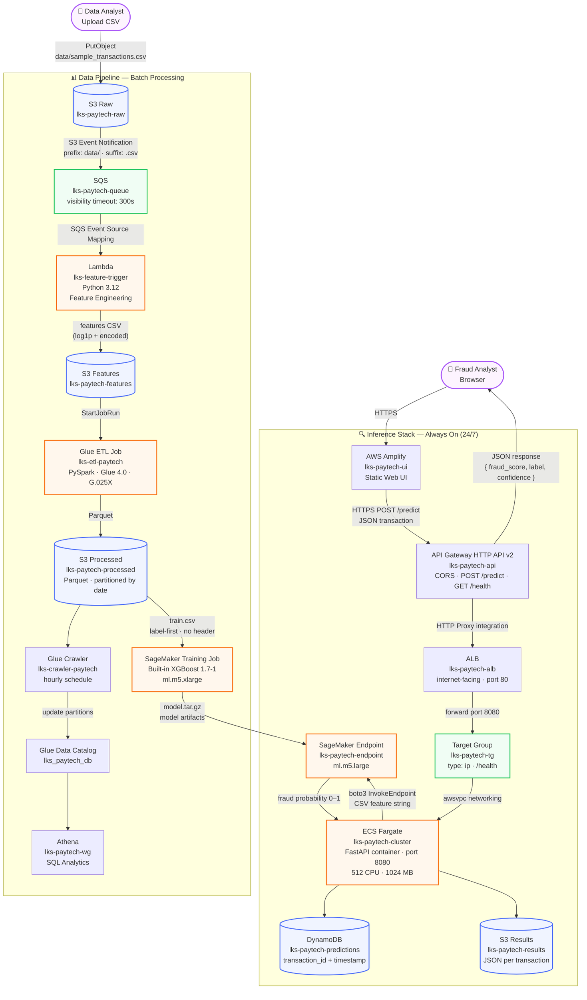

# LKS Cloud Computing — ML Pipeline with ECS Inference

**Perusahaan:** PT. Nusantara PayTech  
**Waktu:** 4 jam  
**Tingkat Kesulitan:** ★★★★☆

---

## Latar Belakang

PT. Nusantara PayTech adalah platform pembayaran digital yang memproses jutaan transaksi setiap hari. Tim keamanan menghadapi tantangan besar: **penipuan (fraud) transaksi meningkat 340% dalam 6 bulan terakhir**, menyebabkan kerugian lebih dari Rp 12 miliar.

Tim data science telah membangun model Machine Learning XGBoost yang dapat mendeteksi transaksi fraud dengan akurasi 94%. Kini mereka membutuhkan **infrastruktur cloud yang scalable** untuk:

1. **Pipeline pengolahan data** — mengolah data transaksi mentah secara otomatis
2. **API prediksi real-time** — memberikan skor fraud dalam < 200ms untuk setiap transaksi

---

## Arsitektur yang Harus Dibangun



---

## Tugas

### Task 1 — Setup Infrastruktur Dasar (30 poin)

Buat infrastruktur penyimpanan dan messaging berikut:

**a. S3 Buckets (4 bucket):**
- `lks-paytech-raw-{ACCOUNT_ID}` — data transaksi CSV mentah
- `lks-paytech-features-{ACCOUNT_ID}` — data setelah feature engineering
- `lks-paytech-processed-{ACCOUNT_ID}` — data Parquet hasil Glue ETL
- `lks-paytech-results-{ACCOUNT_ID}` — hasil prediksi (JSON per transaksi)

**b. SQS Queue:**
- Nama: `lks-paytech-queue`
- Visibility timeout: 300 detik
- Aktifkan S3 Event Notification dari bucket raw ke SQS (filter: prefix `data/`, suffix `.csv`)

**c. Lambda — Feature Trigger:**
- Nama: `lks-feature-trigger`
- Runtime: Python 3.12
- Tugas: membaca pesan SQS → download CSV dari S3 raw → lakukan feature engineering dasar → simpan ke S3 features

Feature engineering yang harus dilakukan di Lambda:
- Encode `merchant_category` ke angka (grocery=0, electronics=1, restaurant=2, gas=3, travel=4, online=5)
- Normalisasi `amount` (log1p)
- Normalisasi `distance_from_home_km` (log1p)
- Hapus kolom `transaction_id` dari file fitur (simpan di metadata)

---

### Task 2 — Glue ETL + Athena (20 poin)

**a. Glue ETL Job:**
- Nama: `lks-etl-paytech`
- Tipe: PySpark (Glue 4.0, G.025X, 2 workers)
- Input: S3 features bucket (`s3://lks-paytech-features-{ACCOUNT_ID}/features/`)
- Output: S3 processed bucket (`s3://lks-paytech-processed-{ACCOUNT_ID}/parquet/`), format Parquet, dipartisi per `year/month/day`
- Hapus duplikat berdasarkan semua kolom

**b. Glue Crawler:**
- Nama: `lks-crawler-paytech`
- Database: `lks_paytech_db`
- Source: S3 processed bucket
- Jadwal: setiap jam

**c. Athena:**
- Workgroup: `lks-paytech-wg`
- Output queries: S3 processed bucket, prefix `athena-results/`

---

### Task 3 — SageMaker Training + Endpoint (25 poin)

**a. Training Job:**
- Algoritma: XGBoost bawaan AWS (versi terbaru)
- Data training: file `train.csv` dari folder `data/` — upload ke S3 processed bucket
- Instance training: `ml.m5.xlarge`
- Hyperparameter:
  - `objective`: `binary:logistic`
  - `num_round`: `150`
  - `max_depth`: `5`
  - `eta`: `0.2`
  - `scale_pos_weight`: `4` (kompensasi class imbalance ~20% fraud)

**b. Endpoint:**
- Nama: `lks-paytech-endpoint`
- Instance: `ml.m5.large`
- ⚠️ **Endpoint dikenakan biaya $0.096/jam — hapus setelah selesai!**

---

### Task 4 — ECS Fargate Inference Server (30 poin)

Buat server API inference yang berjalan 24/7 menggunakan ECS Fargate.

**a. ECR Repository:**
- Nama: `lks-paytech-api`
- Build image dari `app/inference_api/`

**b. ECS Cluster + Task:**
- Cluster: `lks-paytech-cluster`
- Task Definition: `lks-paytech-task`
- Container: port 8080, CPU 512, Memory 1024 MB
- Environment variables: `SAGEMAKER_ENDPOINT_NAME`, `DYNAMODB_TABLE`, `RESULTS_BUCKET`, `AWS_DEFAULT_REGION`

**c. ALB + ECS Service:**
- ALB: `lks-paytech-alb` (internet-facing)
- Target Group: port 8080, health check path `/health`
- Service: `lks-paytech-service`, desired count 1

**d. API Gateway:**
- Tipe: HTTP API v2
- Nama: `lks-paytech-api`
- Route: `POST /predict` → HTTP integration ke ALB URL
- Route: `GET /health` → HTTP integration ke ALB URL
- CORS: enable untuk semua origin

**e. DynamoDB:**
- Tabel: `lks-paytech-predictions`
- Partition key: `transaction_id` (String)
- Sort key: `timestamp` (String)
- Billing: PAY_PER_REQUEST

FastAPI container harus:
- `GET /health` → `{"status": "ok"}`
- `POST /predict` → terima JSON transaksi → panggil SageMaker endpoint → simpan ke DynamoDB + S3 → kembalikan:
  ```json
  {
    "transaction_id": "txn-123",
    "fraud_score": 0.87,
    "label": "FRAUD",
    "confidence": "HIGH",
    "timestamp": "2026-05-01T10:00:00Z"
  }
  ```

Label threshold:
- fraud_score < 0.3 → `NORMAL` (confidence: LOW/MEDIUM/HIGH berdasarkan jarak dari threshold)
- fraud_score ≥ 0.3 → `FRAUD`

---

### Task 5 — Amplify Web UI (Bonus, 10 poin)

Deploy halaman HTML statis ke AWS Amplify (tanpa Git integration):
- Form input: semua field transaksi
- Kirim POST ke API Gateway URL
- Tampilkan hasil prediksi dengan warna:
  - NORMAL: hijau ✅
  - FRAUD: merah 🚨

---

## Kriteria Penilaian

| Task | Kriteria | Poin |
|---|---|---|
| 1a | 4 bucket S3 terbuat dengan nama yang benar | 10 |
| 1b | SQS queue + S3 event notification berjalan | 10 |
| 1c | Lambda mengolah file CSV dan menyimpan features ke S3 | 10 |
| 2a | Glue ETL job berhasil dijalankan dan menghasilkan Parquet | 8 |
| 2b | Crawler + Athena dapat query data processed | 12 |
| 3a | Training job berhasil menghasilkan model | 10 |
| 3b | Endpoint aktif dan bisa di-invoke | 15 |
| 4a-b | ECR image + ECS task definition terbuat | 10 |
| 4c | ECS service running behind ALB (health check pass) | 10 |
| 4d-e | API Gateway route + DynamoDB record tersimpan | 10 |
| Bonus | Amplify UI bisa submit form dan tampilkan hasil | 10 |

**Total: 105 poin (100 poin + 5 bonus)**

---

## Resources

- Data transaksi: `data/sample_transactions.csv`
- Data training: `data/train.csv`
- Payload test: `data/test_predict.json`
- Kode Lambda: `app/feature_lambda/handler.py`
- Kode inference API: `app/inference_api/main.py`
- Dockerfile: `app/inference_api/Dockerfile`
- Glue ETL: `glue/etl_job.py`
- Training wrapper: `training/train.py`
