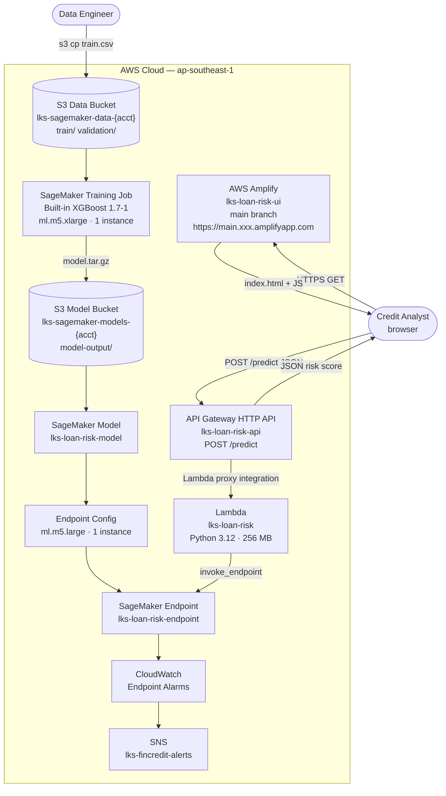

# Module: ML Inference API — Loan Default Risk Prediction

**Duration: 4 Hours – SageMaker XGBoost · API Gateway · AWS Amplify · Real-Time Inference UI**

> **Free Tier / Cost Notice**: SageMaker has a **2-month trial** for new accounts (50 hrs training + 125 hrs inference on ml.m5.xlarge). After the trial: training ≈ $0.03 (5 min on ml.m5.xlarge), endpoint ≈ $0.096/hr on ml.m5.large. **Delete the endpoint immediately after the exam.** Lambda, API Gateway, Amplify, and S3 stay within the free tier.

---

## Description of Project and Tasks

You are a **Machine Learning Engineer** at **PT. Nusantara FinCredit**, a P2P lending platform operating across Indonesia. The company has been manually reviewing loan applications, which takes 3–5 days per case and is inconsistent across reviewers.

The Head of Risk has asked you to build an **automated loan default risk scoring system**: when a credit analyst enters an applicant's profile, the system should instantly return a **default probability and risk classification** (Low / Medium / High). This prediction drives an automated first-pass decision so that analysts focus only on borderline cases.

The system must be built on AWS as a fully managed, serverless stack. The XGBoost model is trained on historical loan data using **Amazon SageMaker's built-in XGBoost algorithm** (no framework code to maintain). A **Lambda function** proxies inference requests from the UI to the SageMaker endpoint, exposed via **API Gateway HTTP API**. The web UI is a static HTML/JS page hosted on **AWS Amplify** — a proper CDN-backed hosting service that serves the form, while the API Gateway handles all backend calls.

---

## Architecture



---

## Tasks

1. Read this entire document before starting
2. Create S3 buckets and upload training data — see **S3** section
3. Create IAM roles (SageMaker, Lambda) — see **IAM Roles** section
4. Train the XGBoost model on SageMaker — see **Training** section
5. Deploy the SageMaker real-time inference endpoint — see **Endpoint** section
6. Deploy Lambda + API Gateway HTTP API — see **API Gateway** section
7. Host the UI on AWS Amplify — see **Amplify** section
8. Set up CloudWatch monitoring and SNS alert — see **Monitoring** section
9. Validate the end-to-end pipeline — see **Validation** section

---

## Technical Details

- Default region: **ap-southeast-1 (Singapore)**
- All manually created IAM Roles must be prefixed **`LKS-`**
- Tag every resource:

  | Tag Key | Value |
  |---|---|
  | `Project` | `nusantara-fincredit` |
  | `Environment` | `production` |
  | `ManagedBy` | `LKS-Team` |

---

## Service Details

### S3

| Bucket | Purpose |
|---|---|
| `lks-sagemaker-data-{ACCOUNT_ID}` | Training and validation CSV data |
| `lks-sagemaker-models-{ACCOUNT_ID}` | SageMaker model artifacts output |

Both buckets: SSE-S3 encryption, public access blocked, **no versioning needed**.

Upload structure:
```
lks-sagemaker-data-{account}/
├── train/train.csv           ← 50-row training set (label-first, no header)
└── validation/validation.csv ← 15-row validation set (same format)
```

**Training CSV column order** (SageMaker XGBoost: label must be first column, no header):
```
default,age,annual_income,loan_amount,loan_term_months,
credit_score,employment_years,debt_to_income_ratio,
has_mortgage,num_credit_lines,num_late_payments
```

> Run `python training/prepare_data.py 300` to regenerate with 300 samples for better model accuracy.

---

### IAM Roles

| Role | Trusted By | Purpose |
|---|---|---|
| `LKS-SageMakerRole` | `sagemaker.amazonaws.com` | Execute training jobs and host endpoints |
| `LKS-LoanRiskLambdaRole` | `lambda.amazonaws.com` | Invoke SageMaker endpoint from Lambda |

`LKS-SageMakerRole` policies:
- Managed: `AmazonSageMakerFullAccess`
- Inline: `LKS-SageMakerS3Policy` (from `iam/sagemaker-role-policy.json`) — scoped S3 access to data and model buckets

`LKS-LoanRiskLambdaRole` policies:
- Managed: `AWSLambdaBasicExecutionRole`
- Inline: `LKS-LoanRiskLambdaPolicy` (from `iam/lambda-role-policy.json`) — `sagemaker:InvokeEndpoint` only

---

### Training

| Property | Value |
|---|---|
| Algorithm | SageMaker Built-in XGBoost |
| XGBoost version | `1.7-1` |
| Instance type | `ml.m5.xlarge` ⚠️ |
| Instance count | `1` |
| Max runtime | `10 minutes` |
| IAM role | `LKS-SageMakerRole` |
| Output path | `s3://lks-sagemaker-models-{account}/model-output/` |

Hyperparameters:

| Parameter | Value | Reason |
|---|---|---|
| `objective` | `binary:logistic` | Binary classification output |
| `num_round` | `150` | Number of boosting rounds |
| `max_depth` | `5` | Tree depth (avoids overfitting on small dataset) |
| `eta` | `0.2` | Learning rate |
| `subsample` | `0.8` | Row subsampling for robustness |
| `colsample_bytree` | `0.8` | Feature subsampling |
| `eval_metric` | `auc` | AUC-ROC for binary classification |
| `scale_pos_weight` | `3` | Compensate for 25% default class imbalance |

**Run training via the Python SDK script:**
```bash
pip install sagemaker boto3
python training/train_deploy.py --train
```
Expected training time: **3–5 minutes**.

---

### Endpoint

| Property | Value |
|---|---|
| Endpoint name | `lks-loan-risk-endpoint` |
| Instance type | `ml.m5.large` ⚠️ |
| Instance count | `1` |
| Invocation content type | `text/csv` |
| Output | Default probability `0.0`–`1.0` (float) |

The endpoint receives 10 feature values as comma-separated CSV (no label) and returns a float representing default probability.

**Deploy endpoint:**
```bash
python training/train_deploy.py --deploy
```

**Manual test:**
```bash
aws sagemaker-runtime invoke-endpoint \
  --endpoint-name lks-loan-risk-endpoint \
  --content-type text/csv \
  --body "42,85000,12000,36,720,12,0.22,1,3,0" \
  --region ap-southeast-1 /dev/stdout
# Expected output: ~0.05 (low risk)
```

> **⚠️ Critical**: Run `python training/train_deploy.py --delete` to stop endpoint billing when done.

---

### API Gateway

| Property | Value |
|---|---|
| API name | `lks-loan-risk-api` |
| Protocol | HTTP API (v2) |
| Route | `POST /predict` |
| Integration | Lambda proxy — `lks-loan-risk` |
| Payload format | `2.0` |
| Stage | `prod` (auto-deploy) |
| CORS | Allow origins `*`, methods `POST OPTIONS`, headers `content-type` |

Invoke URL format: `https://{api-id}.execute-api.ap-southeast-1.amazonaws.com/prod`

#### Lambda (inference proxy)

| Property | Value |
|---|---|
| Function name | `lks-loan-risk` |
| Runtime | Python 3.12 |
| Memory | 256 MB |
| Timeout | 30 seconds |
| IAM role | `LKS-LoanRiskLambdaRole` |
| Handler | `handler.handler` |

Environment variables:

| Key | Value |
|---|---|
| `SAGEMAKER_ENDPOINT_NAME` | `lks-loan-risk-endpoint` |
| `AWS_REGION` | `ap-southeast-1` |

**Request body for `POST /predict`:**
```json
{
  "age": 42,
  "annual_income": 85000,
  "loan_amount": 12000,
  "loan_term_months": 36,
  "credit_score": 720,
  "employment_years": 12,
  "debt_to_income_ratio": 0.22,
  "has_mortgage": 1,
  "num_credit_lines": 3,
  "num_late_payments": 0
}
```

**Response:**
```json
{
  "probability": 5.2,
  "risk_level": "LOW",
  "recommendation": "Approved — Standard loan terms apply"
}
```

Risk thresholds:

| Probability | Risk Level | Decision |
|---|---|---|
| 0–29% | LOW | Approved |
| 30–54% | MEDIUM | Conditional Approval |
| ≥ 55% | HIGH | Rejected |

---

### Amplify

| Property | Value |
|---|---|
| App name | `lks-loan-risk-ui` |
| Branch | `main` |
| Deployment type | Manual (zip upload — no Git repo required) |
| Hosted URL | `https://main.{app-id}.amplifyapp.com` |
| Free tier | 5 GB storage + 15 GB bandwidth/month ✓ |

The UI is a **single static HTML file** (`app/index.html`) that:
- Renders the 10-field loan assessment form
- Calls `POST {API_GATEWAY_URL}/predict` via `fetch()`
- Displays the result with color-coded risk level (green / yellow / red)

**Deployment flow** (handled by `scripts/05-deploy-amplify.sh`):
1. The script injects the real API Gateway URL into `index.html` (replacing the `__API_GATEWAY_URL__` placeholder)
2. Zips the file and uploads it to a pre-signed S3 URL via `aws amplify create-deployment`
3. Starts the Amplify deployment and polls until it succeeds

> Free Tier: Amplify Hosting — 5 GB/month storage, 15 GB/month bandwidth for 12 months. ✓

---

### Monitoring

| Resource | Property | Value |
|---|---|---|
| SNS Topic | Name | `lks-fincredit-alerts` |
| SNS Subscription | Protocol | Email → your address |
| CloudWatch Alarm | Name | `lks-endpoint-error-rate` |
| CloudWatch Alarm | Metric | `SageMaker / Endpoint` → `ModelError` |
| CloudWatch Alarm | Dimensions | `EndpointName=lks-loan-risk-endpoint` |
| CloudWatch Alarm | Threshold | `>= 5 errors` in 5 minutes |
| CloudWatch Alarm | Action | SNS → `lks-fincredit-alerts` |

---

## Validation

Run the automated validation:
```bash
export ACCOUNT_ID=$(aws sts get-caller-identity --query Account --output text)
bash scripts/05-validate.sh
```

**Manual checks:**

1. **Model trained**: SageMaker console → Training jobs → `lks-loan-xgb-*` → status `Completed`
2. **Endpoint live**: SageMaker console → Endpoints → `lks-loan-risk-endpoint` → status `InService`
3. **Inference test** (copy-paste into terminal):
   ```bash
   # Low risk: expected < 0.30
   aws sagemaker-runtime invoke-endpoint \
     --endpoint-name lks-loan-risk-endpoint \
     --content-type text/csv \
     --body "42,85000,12000,36,720,12,0.22,1,3,0" \
     --region ap-southeast-1 /dev/stdout

   # High risk: expected > 0.50
   aws sagemaker-runtime invoke-endpoint \
     --endpoint-name lks-loan-risk-endpoint \
     --content-type text/csv \
     --body "26,32000,20000,60,545,1,0.58,0,8,5" \
     --region ap-southeast-1 /dev/stdout
   ```
4. **UI test**: open the Lambda Function URL in browser → fill in test cases from `data/test_samples.json` → verify risk classification matches expected values
5. **CloudWatch**: SageMaker console → Endpoints → `lks-loan-risk-endpoint` → Monitoring → confirm invocation metrics appear

---

## Files

```
lks-sagemaker-xgboost/
├── README.md                          ← This file (exam question)
├── jawaban.md                         ← Step-by-step answer key
├── data/
│   ├── train.csv                      ← 50-row training set (label-first, no header)
│   ├── validation.csv                 ← 15-row validation set (same format)
│   └── test_samples.json             ← UI test cases with expected outputs
├── training/
│   ├── prepare_data.py               ← Generate larger synthetic dataset
│   └── train_deploy.py               ← SageMaker SDK: train, deploy, delete
├── app/
│   ├── index.html                     ← Static UI (hosted on Amplify)
│   ├── handler.py                     ← Lambda: inference proxy only
│   └── requirements.txt
├── iam/
│   ├── sagemaker-role-trust.json
│   ├── sagemaker-role-policy.json
│   └── lambda-role-policy.json
└── scripts/
    ├── 01-setup-s3.sh                ← Create buckets + upload data
    ├── 02-create-iam.sh              ← Create IAM roles
    ├── 03-train-deploy.sh            ← Run train_deploy.py (train + deploy)
    ├── 04-setup-api-gateway.sh       ← Deploy Lambda + create API Gateway HTTP API
    ├── 05-deploy-amplify.sh          ← Inject API URL + deploy index.html to Amplify
    └── 06-validate.sh                ← End-to-end validation (API tests + Amplify check)
```

---

*Good luck — manage your time wisely! Remember to delete the SageMaker endpoint when done.*
