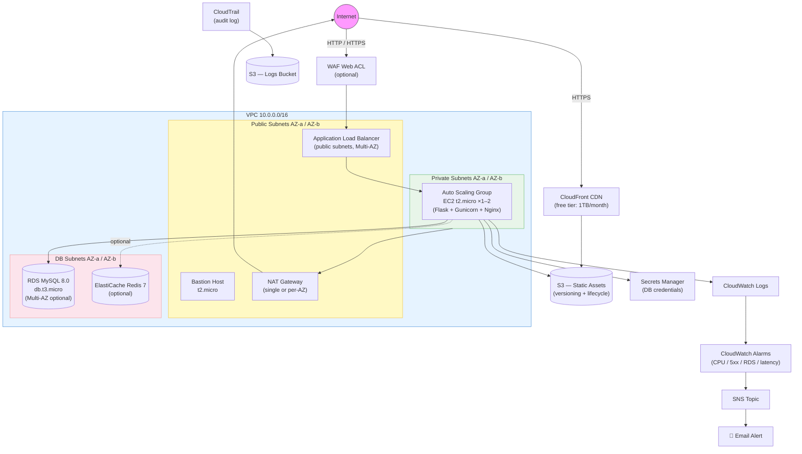

# LKS Indonesia 2025 – AWS Infrastructure with Terraform

Production-grade AWS infrastructure for LKS (Lomba Kompetensi Siswa) Cloud Computing competition.  
Supports **Free Tier mode** with optional flags to unlock paid features for extra scoring points.

---

## Architecture



---

## Free Tier vs Paid Features

| Feature | Variable | Free Tier Default | Est. Cost When Enabled |
|---------|----------|:-----------------:|------------------------|
| EC2 t2.micro (1 instance) | `instance_type` | **t2.micro** | Included 750 hrs/month |
| RDS db.t3.micro single-AZ | `db_instance_class` | **db.t3.micro** | Included 750 hrs/month |
| NAT Gateway (single) | `single_nat_gateway` | `true` | ~$32/month (NOT free) |
| RDS Multi-AZ | `enable_multi_az` | `false` | ~$30/month extra |
| RDS Read Replica | `enable_read_replica` | `false` | ~$15/month |
| ElastiCache Redis | `enable_elasticache` | `false` | ~$12/month |
| WAF Web ACL | `enable_waf` | `false` | ~$5+/month |
| KMS CMK | `enable_kms_cmk` | `false` | $1/month |
| CloudFront | always on | **free** | Included 1TB/month |
| S3 | always on | **free** | Included 5GB |
| ALB | always on | **free** | Included 750 LCU-hrs |
| CloudWatch Alarms | always on | **free** | Included 10 alarms |
| Secrets Manager | always on | ~$0.40/secret | minimal |

> **Minimum monthly cost on free tier account**: ~$32–35 (just the NAT Gateway).  
> **NAT Gateway is not avoidable** if app servers must be in private subnets.

---

## AWS Services Used

| Category | Service | Purpose |
|----------|---------|---------|
| Networking | VPC, Subnets, IGW, NAT GW | Isolated network + internet access |
| Security | WAF, Security Groups, IAM | Attack filtering & least-privilege access |
| Encryption | KMS (optional), AES-256 | Data at rest & in transit |
| Compute | EC2 + Auto Scaling Group | Scalable application layer |
| Load Balancing | ALB | HTTP/HTTPS traffic distribution |
| Database | RDS MySQL 8.0 | Relational data store |
| Cache | ElastiCache Redis (optional) | Session store & query caching |
| Storage | S3 (3 buckets) | Assets, logs, CloudTrail |
| CDN | CloudFront | Global static file delivery |
| Secrets | Secrets Manager | Encrypted DB credentials |
| Monitoring | CloudWatch + SNS | Alarms & email notifications |
| Audit | CloudTrail | Full API audit log |

---

## Edge Cases (Extra Points for LKS)

| # | Feature | How Implemented |
|---|---------|----------------|
| 1 | **Multi-AZ HA** | `enable_multi_az = true` on RDS; NAT per AZ | 
| 2 | **WAF + Rate Limiting** | AWS Managed Rules + 2000 req/5min per IP |
| 3 | **IMDSv2 enforced** | `http_tokens = "required"` on all EC2 (SSRF protection) |
| 4 | **Encrypted storage** | KMS CMK or AES-256 on RDS, S3, Secrets Manager |
| 5 | **TLS 1.3 only** | `ELBSecurityPolicy-TLS13-1-2-2021-06` on HTTPS listener |
| 6 | **RDS Read Replica** | `enable_read_replica = true` to offload reads |
| 7 | **Scheduled Auto Scaling** | Pre-warm 08:00 WIB, scale down 23:00 WIB |
| 8 | **Dual-metric Target Tracking** | CPU 60% + ALB 1000 RPS per instance |
| 9 | **S3 Lifecycle tiering** | IA after 90d → Glacier after 365d |
| 10 | **VPC Flow Logs** | ALL traffic logged to CloudWatch |
| 11 | **CloudTrail** | Multi-region with S3 data events |
| 12 | **S3 Presigned Upload URLs** | `/api/upload-url` endpoint (direct client→S3) |
| 13 | **Redis TTL caching** | 60s on list, 120s on single item |
| 14 | **p99 latency alarm** | CloudWatch `TargetResponseTime` p99 > 2s |
| 15 | **Drop invalid HTTP headers** | `drop_invalid_header_fields = true` on ALB |

---

## Prerequisites

1. **AWS CLI** configured
   ```bash
   aws configure
   aws sts get-caller-identity    # verify credentials
   ```

2. **Terraform** ≥ 1.6
   ```bash
   # macOS
   brew tap hashicorp/tap && brew install hashicorp/tap/terraform
   terraform -version
   ```

3. **EC2 Key Pair** (optional – for SSH to bastion)
   ```bash
   aws ec2 create-key-pair \
     --key-name lks-keypair \
     --query 'KeyMaterial' \
     --output text > ~/.ssh/lks-keypair.pem
   chmod 400 ~/.ssh/lks-keypair.pem
   ```

---

## Step-by-Step Deployment

### Step 1 — Enter the project folder

```bash
cd lks-terraform-aws
```

### Step 2 — Create your variables file

```bash
cp terraform.tfvars.example terraform.tfvars
```

Edit the minimum required values:
```hcl
# terraform.tfvars
aws_region    = "ap-southeast-1"
alert_email   = "your@email.com"
key_pair_name = "lks-keypair"     # key you created above
```

### Step 3 — Initialize Terraform

```bash
terraform init
```

### Step 4 — Validate the configuration

```bash
terraform validate
# Success! The configuration is valid.
```

### Step 5 — Preview changes

```bash
terraform plan -out=tfplan
# ~55–60 resources will be created
```

### Step 6 — Deploy

```bash
terraform apply tfplan
```

Expected duration:
- VPC + subnets: ~1 min
- RDS MySQL: ~8–10 min
- ALB + ASG: ~3 min
- **Total: ~12–15 min**

### Step 7 — Confirm SNS subscription

Check your email inbox and click **Confirm subscription** to activate CloudWatch alerts.

### Step 8 — Verify the deployment

```bash
# Get ALB address
ALB=$(terraform output -raw alb_dns_name)
echo "App: http://$ALB"

# Health check
curl -s http://$ALB/health | python3 -m json.tool
```

Expected response:
```json
{
  "status": "healthy",
  "database": "ok",
  "cache": "ok",
  "timestamp": "2025-..."
}
```

### Step 9 — Test the REST API

```bash
ALB=$(terraform output -raw alb_dns_name)

# List items
curl http://$ALB/api/items

# Create an item
curl -X POST http://$ALB/api/items \
  -H "Content-Type: application/json" \
  -d '{"name":"LKS Test","description":"Competition test item"}'

# Get item by ID
curl http://$ALB/api/items/1

# Update item
curl -X PUT http://$ALB/api/items/1 \
  -H "Content-Type: application/json" \
  -d '{"name":"Updated Item"}'

# Delete item
curl -X DELETE http://$ALB/api/items/1

# Get presigned S3 upload URL
curl -X POST http://$ALB/api/upload-url \
  -H "Content-Type: application/json" \
  -d '{"filename":"photo.jpg"}'
```

### Step 10 — View the CloudWatch Dashboard

```bash
REGION=$(grep aws_region terraform.tfvars | awk -F'"' '{print $2}')
DASHBOARD=$(terraform output -raw dashboard_name 2>/dev/null || echo "lks-app-production-dashboard")
echo "https://$REGION.console.aws.amazon.com/cloudwatch/home?region=$REGION#dashboards:name=$DASHBOARD"
```

---

## Connect to Bastion Host

```bash
BASTION_IP=$(terraform output -raw bastion_public_ip)

# SSH (requires key pair)
ssh -i ~/.ssh/lks-keypair.pem ec2-user@$BASTION_IP

# SSM Session Manager (no SSH key needed)
BASTION_ID=$(terraform output -raw bastion_instance_id)
aws ssm start-session --target $BASTION_ID

# From bastion → connect to RDS
SECRET_ARN=$(terraform output -raw db_secret_arn)
DB_HOST=$(aws secretsmanager get-secret-value \
  --secret-id "$SECRET_ARN" \
  --query SecretString --output text | python3 -c "import sys,json; print(json.load(sys.stdin)['host'])")
mysql -h $DB_HOST -u dbadmin -p
```

---

## Upgrade to Full HA (Paid Features / Extra Points)

Edit `terraform.tfvars` and set the desired flags, then re-apply:

```hcl
# Uncomment to enable extra-point features (NOT free tier):
enable_multi_az      = true    # RDS Multi-AZ  (~+$30/month)
enable_read_replica  = true    # RDS replica    (~+$15/month)
enable_elasticache   = true    # Redis cache    (~+$12/month)
enable_waf           = true    # WAF            (~+$5/month)
enable_kms_cmk       = true    # KMS CMK        (~+$1/month)
single_nat_gateway   = false   # NAT per AZ     (~+$32/month)
instance_type        = "t3.small"
min_capacity         = 2
desired_capacity     = 2
```

```bash
terraform plan -out=tfplan
terraform apply tfplan
```

---

## Deleting All Resources (terraform destroy)

> **This deletes everything permanently.** Run this when you are done with the competition or testing.

### Step 1 — Make sure deletion protection is off

In `terraform.tfvars`:
```hcl
enable_deletion_protection = false
```

Apply only that change first:
```bash
terraform apply -var="enable_deletion_protection=false"
```

### Step 2 — Empty the S3 buckets (required before destroy)

S3 buckets with objects cannot be deleted by Terraform unless `force_destroy = true`.  
The buckets in this project already have `force_destroy = true`, so this is automatic.  
If you added objects manually, empty them first:

```bash
ASSETS=$(terraform output -raw assets_bucket_name)
LOGS=$(terraform output -raw logs_bucket_name)

aws s3 rm s3://$ASSETS --recursive
aws s3 rm s3://$LOGS   --recursive
```

### Step 3 — Destroy all resources

```bash
terraform destroy
```

Type **`yes`** when prompted. This will take ~5–10 minutes.

### Step 4 — Verify nothing remains

```bash
# Confirm all resources are gone
terraform show
# Should output: No state.

# Double-check RDS is gone (avoid surprise charges)
aws rds describe-db-instances --query 'DBInstances[*].[DBInstanceIdentifier,DBInstanceStatus]' --output table

# Double-check NAT Gateways (they continue billing until fully deleted)
aws ec2 describe-nat-gateways \
  --filter Name=state,Values=available \
  --query 'NatGateways[*].[NatGatewayId,State]' --output table

# Double-check ElastiCache (if enabled)
aws elasticache describe-replication-groups \
  --query 'ReplicationGroups[*].[ReplicationGroupId,Status]' --output table
```

### Step 5 — Release Elastic IPs (if any remain)

```bash
aws ec2 describe-addresses \
  --query 'Addresses[?AssociationId==null].[AllocationId,PublicIp]' \
  --output table

# Release a specific unattached EIP
aws ec2 release-address --allocation-id <eipalloc-xxxx>
```

### Destroy a specific module only

```bash
# Example: destroy only the database
terraform destroy -target=module.database

# Example: destroy only monitoring
terraform destroy -target=module.monitoring
```

---

## Troubleshooting

**EC2 instances unhealthy in target group**
```bash
# Check app startup logs
BASTION_ID=$(terraform output -raw bastion_instance_id)
aws ssm start-session --target $BASTION_ID
# Inside session:
sudo journalctl -u lksapp -n 50
sudo tail -100 /var/log/cloud-init-output.log
```

**`terraform destroy` hangs on RDS**
- Ensure `enable_deletion_protection = false` was applied before running destroy
- Check if a final snapshot is being created: `aws rds describe-db-instances`

**NAT Gateway still billing after destroy**
- Wait 5–10 min for state to change from `deleting` → `deleted`
- Check: `aws ec2 describe-nat-gateways --filter Name=state,Values=deleting`

**Secrets Manager secret can't be re-created with same name**
- It has a 7-day recovery window by default. This project sets `recovery_window_in_days = 0` for instant deletion.
- If you still hit this: `aws secretsmanager delete-secret --secret-id <arn> --force-delete-without-recovery`

**WAF blocking your own requests**
- Set `override_action { count {} }` instead of `none {}` to test rules without blocking
- Check WAF logs in CloudWatch under `/aws/wafv2/...`

---

## Project Structure

```
lks-terraform-aws/
├── main.tf                    # Root – wires all modules together
├── variables.tf               # All input variables (free tier defaults)
├── outputs.tf                 # Key resource outputs
├── versions.tf                # Terraform + provider version locks
├── terraform.tfvars.example   # Template – copy to terraform.tfvars
├── .gitignore
├── modules/
│   ├── vpc/       VPC, subnets, IGW, NAT GW (single or per-AZ), Flow Logs
│   ├── security/  Security Groups, WAF (optional), KMS (optional), IAM
│   ├── alb/       ALB, Target Group, HTTP→HTTPS redirect
│   ├── compute/   Launch Template (IMDSv2), ASG, scaling policies, Bastion
│   ├── database/  RDS MySQL, read replica (optional), ElastiCache (optional), Secrets Manager
│   ├── storage/   S3 assets + logs, CloudFront CDN, lifecycle rules
│   └── monitoring/CloudWatch alarms (7), SNS email, CloudTrail, Dashboard
└── scripts/
    └── user_data.sh   Bootstrap: installs Flask app + Gunicorn + Nginx + CW Agent
```

---

*Built for LKS Indonesia 2025 – Cloud Computing Category*
