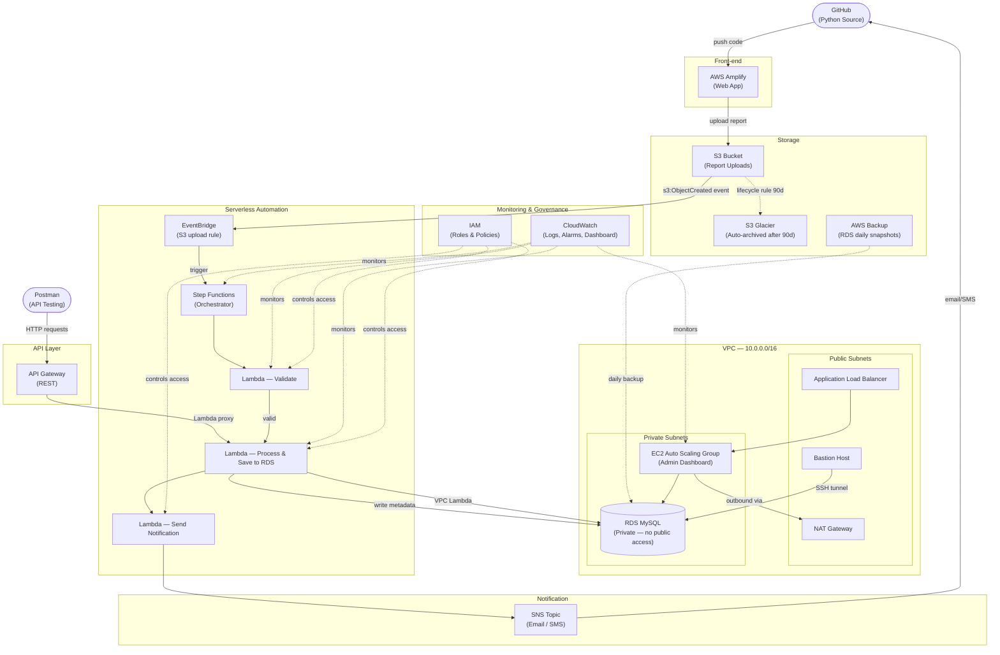

# Serverless Automation Platform

An event-driven report processing system built for LKS (Lomba Kompetensi Siswa) — Serverless & Automation theme.

Users upload reports via a web frontend. The system automatically validates, processes, stores, and notifies stakeholders — all without manual intervention.

---

## Architecture



---

## Data Flow

```
1. User uploads report (CSV/JSON) via Amplify → S3
2. S3 ObjectCreated event → EventBridge rule fires
3. EventBridge → triggers Step Functions execution
4. Step Functions runs in order:
   ├── Lambda: Validate (check format, required fields)
   ├── Lambda: Process (parse data, save to RDS MySQL)
   └── Lambda: Notify (publish to SNS → email/SMS)
5. S3 lifecycle rule archives files to Glacier after 90 days
6. AWS Backup takes daily RDS snapshots
7. EC2 Admin Dashboard (behind ALB + ASG) reads from RDS
8. API Gateway exposes REST endpoints for Postman/external clients
9. CloudWatch collects all logs and triggers alarms on failure
```

---

## Manual Provisioning Guide

> Provision in this order to respect dependencies.

### 1. IAM Roles

Create the following roles in **IAM → Roles → Create role**:

| Role Name | Trusted Entity | Policies |
|-----------|---------------|----------|
| `lks-lambda-role` | Lambda | `AWSLambdaVPCAccessExecutionRole`, `AmazonRDSFullAccess`, `AmazonS3ReadOnlyAccess`, `AmazonSNSFullAccess`, `SecretsManagerReadWrite`, `CloudWatchLogsFullAccess` |
| `lks-stepfunctions-role` | Step Functions | `AWSLambdaRole`, `CloudWatchLogsFullAccess` |
| `lks-ec2-role` | EC2 | `AmazonRDSReadOnlyAccess`, `CloudWatchAgentServerPolicy` |
| `lks-backup-role` | AWS Backup | `AWSBackupServiceRolePolicyForBackup` |

---

### 2. VPC & Networking

Go to **VPC → Create VPC → VPC and more**:

```
VPC CIDR:              10.0.0.0/16
Public Subnet 1:       10.0.1.0/24  (AZ-a)
Public Subnet 2:       10.0.2.0/24  (AZ-b)
Private Subnet 1:      10.0.10.0/24 (AZ-a)
Private Subnet 2:      10.0.11.0/24 (AZ-b)
Internet Gateway:      attach to VPC
NAT Gateway:           in Public Subnet 1 (allocate EIP)
Route Tables:
  public-rt  → 0.0.0.0/0 → IGW  (associate public subnets)
  private-rt → 0.0.0.0/0 → NAT  (associate private subnets)
```

#### Security Groups

| SG Name | Inbound | Outbound |
|---------|---------|----------|
| `bastion-sg` | TCP:22 from `0.0.0.0/0` | All |
| `alb-sg` | TCP:80, TCP:443 from `0.0.0.0/0` | All |
| `ec2-sg` | TCP:8080 from `alb-sg` | All |
| `lambda-sg` | None | TCP:3306 to `rds-sg`, TCP:443 to `0.0.0.0/0` |
| `rds-sg` | TCP:3306 from `lambda-sg`, TCP:3306 from `bastion-sg`, TCP:3306 from `ec2-sg` | None |

---

### 3. RDS (Private)

Go to **RDS → Create database**:

```
Engine:              MySQL 8.0
Template:            Free tier / Dev-Test
DB identifier:       lks-db
Master username:     admin
Master password:     <your-password>
Instance class:      db.t3.micro
Storage:             20 GB gp2
VPC:                 lks-vpc
Subnet group:        create new → select private-subnet-1 & private-subnet-2
Public access:       NO  ← critical
Security group:      rds-sg
```

Store credentials in **Secrets Manager → Store a new secret → RDS credentials**.

---

### 4. S3 Bucket

Go to **S3 → Create bucket**:

```
Bucket name:         lks-reports-<your-account-id>
Region:              ap-southeast-1
Block public access: ON (all blocked)
Versioning:          Enabled
```

#### Lifecycle Rule (auto-archive to Glacier)

S3 → bucket → Management → Lifecycle rules → Create:
```
Rule name:      archive-to-glacier
Prefix:         processed/
Transitions:    Move to S3 Glacier after 90 days
```

#### Enable EventBridge Notifications

S3 → bucket → Properties → Amazon EventBridge → **Enable**

---

### 5. SNS Topic

Go to **SNS → Topics → Create topic**:

```
Type:        Standard
Name:        lks-notifications
```

Create a subscription: Protocol = **Email**, enter your email, confirm it.

---

### 6. Lambda Functions

Go to **Lambda → Create function** for each:

#### a. `lks-validate`
```
Runtime:       Python 3.12
Role:          lks-lambda-role
VPC:           lks-vpc, private subnets, lambda-sg
Timeout:       30s
```
Upload code from `lambdas/validate/index.py`

#### b. `lks-process`
```
Runtime:       Python 3.12
Role:          lks-lambda-role
VPC:           lks-vpc, private subnets, lambda-sg
Timeout:       60s
Environment:
  SECRET_ARN   → (your Secrets Manager ARN)
  DB_NAME      → lksdb
  SNS_TOPIC    → (your SNS Topic ARN)
```
Upload code from `lambdas/process/index.py`

#### c. `lks-notify`
```
Runtime:       Python 3.12
Role:          lks-lambda-role
Timeout:       15s
Environment:
  SNS_TOPIC    → (your SNS Topic ARN)
```
Upload code from `lambdas/notify/index.py`

> Add `pymysql` as a Lambda Layer for `lks-validate` and `lks-process`.

---

### 7. Step Functions

Go to **Step Functions → State machines → Create**:

```
Type:    Standard
Name:    lks-report-pipeline
Role:    lks-stepfunctions-role
```

Definition:

```json
{
  "Comment": "LKS Report Processing Pipeline",
  "StartAt": "Validate",
  "States": {
    "Validate": {
      "Type": "Task",
      "Resource": "<lks-validate Lambda ARN>",
      "Next": "Process",
      "Catch": [{
        "ErrorEquals": ["ValidationError"],
        "Next": "NotifyFailure"
      }]
    },
    "Process": {
      "Type": "Task",
      "Resource": "<lks-process Lambda ARN>",
      "Next": "Notify"
    },
    "Notify": {
      "Type": "Task",
      "Resource": "<lks-notify Lambda ARN>",
      "End": true
    },
    "NotifyFailure": {
      "Type": "Task",
      "Resource": "<lks-notify Lambda ARN>",
      "End": true
    }
  }
}
```

---

### 8. EventBridge Rule

Go to **EventBridge → Rules → Create rule**:

```
Name:          lks-s3-upload-trigger
Event bus:     default
Event pattern:
  {
    "source": ["aws.s3"],
    "detail-type": ["Object Created"],
    "detail": {
      "bucket": { "name": ["lks-reports-<your-account-id>"] }
    }
  }

Target:        Step Functions → lks-report-pipeline
Role:          create new (EventBridge will auto-create)
```

---

### 9. EC2 Auto Scaling Group (Admin Dashboard)

#### Launch Template

Go to **EC2 → Launch Templates → Create**:

```
AMI:             Amazon Linux 2
Instance type:   t3.micro
Key pair:        your-keypair
Security group:  ec2-sg
IAM profile:     lks-ec2-role
User data:
  #!/bin/bash
  yum update -y
  yum install -y python3 pip
  pip3 install flask pymysql boto3
```

#### Auto Scaling Group

Go to **EC2 → Auto Scaling Groups → Create**:

```
Launch template:    (above)
VPC:               lks-vpc
Subnets:           private-subnet-1, private-subnet-2
Load balancer:     Attach to new ALB
  ALB name:        lks-alb
  Scheme:          Internet-facing
  Listener:        HTTP:80
  Target group:    lks-ec2-tg (HTTP:8080)
Min:   1
Max:   3
Desired: 1
Scaling policy: Target tracking → CPU 60%
```

#### Bastion Host

Go to **EC2 → Launch instance**:

```
AMI:             Amazon Linux 2
Instance type:   t3.micro
Subnet:          public-subnet-1
Security group:  bastion-sg
Key pair:        your-keypair
```

---

### 10. AWS Backup

Go to **AWS Backup → Backup plans → Create**:

```
Plan name:       lks-backup-plan
Rule:
  Backup vault:  Default
  Frequency:     Daily
  Retention:     7 days
  Start time:    02:00 UTC
Resource:        RDS → lks-db
IAM role:        lks-backup-role
```

---

### 11. API Gateway

Go to **API Gateway → Create API → REST API**:

```
Name:    lks-api
```

Resources & Methods:

| Method | Path | Integration |
|--------|------|-------------|
| GET | `/reports` | Lambda — `lks-process` |
| POST | `/reports` | Lambda — `lks-process` |
| GET | `/reports/{id}` | Lambda — `lks-process` |

Deploy to stage: `prod`

---

### 12. AWS Amplify

Go to **Amplify → New app → Host web app**:

```
Source:          GitHub → connect your repo
Branch:          main
Build settings:  (auto-detected or set manually)
Environment:     API_URL = <API Gateway URL>
```

---

### 13. CloudWatch

#### Log Groups
Lambda automatically creates log groups. Also create:
- `/lks/ec2/app` — for EC2 app logs (use CloudWatch Agent)

#### Alarms

Go to **CloudWatch → Alarms → Create**:

| Alarm | Metric | Threshold |
|-------|--------|-----------|
| `lks-lambda-errors` | Lambda Errors (lks-process) | > 1 in 5min |
| `lks-stepfn-failed` | StepFunctions ExecutionsFailed | > 0 in 5min |
| `lks-ec2-cpu` | EC2 CPUUtilization (ASG) | > 80% for 2 periods |
| `lks-rds-connections` | RDS DatabaseConnections | > 50 |

Set all alarm actions → SNS topic `lks-notifications`.

#### Dashboard

CloudWatch → Dashboards → Create `lks-dashboard`:
- Lambda invocations & errors
- Step Functions execution count & failures
- EC2 CPU & network
- RDS connections & read/write latency

---

## Testing with Postman

Set base URL variable: `{{base_url}}` = your API Gateway URL

| Test | Method | URL | Body |
|------|--------|-----|------|
| List reports | GET | `{{base_url}}/reports` | — |
| Submit report | POST | `{{base_url}}/reports` | `{"filename":"report.csv","data":[...]}` |
| Get report | GET | `{{base_url}}/reports/1` | — |

---

## Connecting to RDS via Bastion

```bash
# SSH into Bastion
ssh -i "your-key.pem" ec2-user@<bastion-public-ip>

# From Bastion, connect to RDS directly
mysql -h <rds-endpoint> -P 3306 -u admin -p lksdb

# OR: SSH tunnel from local machine
ssh -i "your-key.pem" -N -L 3307:<rds-endpoint>:3306 ec2-user@<bastion-public-ip>
mysql -h 127.0.0.1 -P 3307 -u admin -p lksdb
```

---

## Project Structure

```
serverless_automation_platform/
├── README.md
└── lambdas/
    ├── validate/
    │   └── index.py      ← validate uploaded file
    ├── process/
    │   └── index.py      ← parse & save to RDS
    └── notify/
        └── index.py      ← publish to SNS
```
