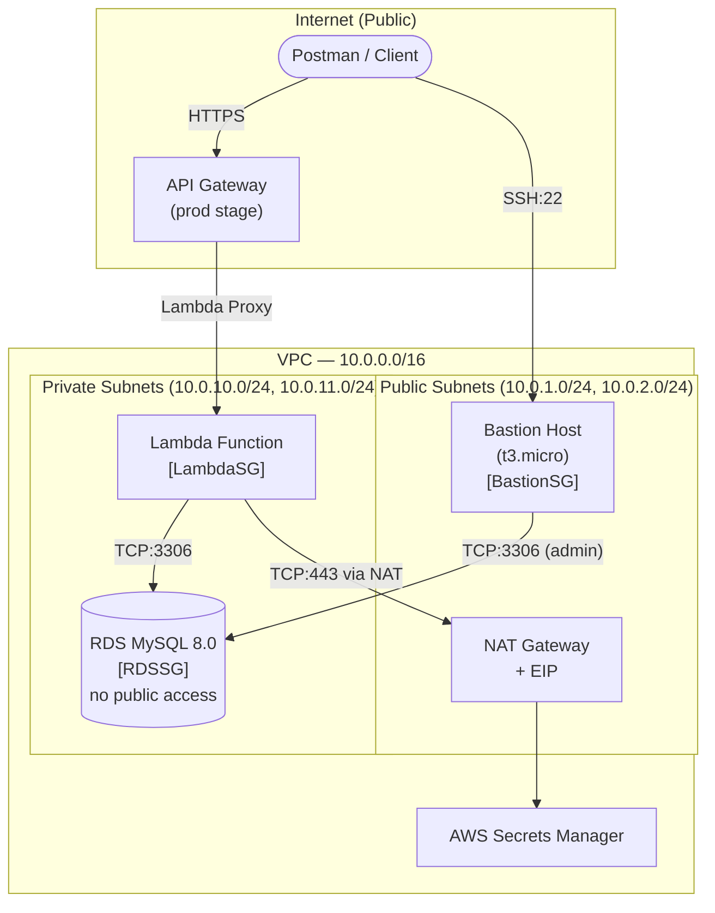

# Serverless Private API

A serverless CRUD API built with AWS Lambda, API Gateway, and RDS MySQL — all inside a private VPC. Built for LKS (Lomba Kompetensi Siswa) competition practice.

## Architecture



## Security Design

| Rule | Detail |
|------|--------|
| RDS not publicly accessible | `PubliclyAccessible: false` |
| RDS ingress | Only from `LambdaSG` and `BastionSG` on port 3306 |
| Lambda egress | Only TCP:3306 to `RDSSG` and TCP:443 to internet (Secrets Manager via NAT) |
| Bastion ingress | SSH:22 from configurable CIDR |
| DB credentials | Stored in AWS Secrets Manager, never in env vars |

## API Endpoints

| Method | Path | Description |
|--------|------|-------------|
| `GET` | `/items` | List all items |
| `POST` | `/items` | Create an item |
| `DELETE` | `/items/{id}` | Delete an item by ID |

### Example Requests

```bash
# List items
curl https://<api-id>.execute-api.ap-southeast-1.amazonaws.com/prod/items

# Create item
curl -X POST https://<api-id>.execute-api.ap-southeast-1.amazonaws.com/prod/items \
  -H "Content-Type: application/json" \
  -d '{"name":"item1","value":"hello LKS"}'

# Delete item
curl -X DELETE https://<api-id>.execute-api.ap-southeast-1.amazonaws.com/prod/items/1
```

## Deploy

### Prerequisites
- AWS CLI configured
- EC2 Key Pair created in target region
- `pymysql` Lambda Layer (see note below)

### Deploy Stack

```bash
export DB_PASSWORD="YourPassword123!"
export BASTION_KEY_NAME="your-keypair-name"
./scripts/deploy.sh
```

RDS takes ~5-10 minutes to provision.

### Get Outputs

```bash
aws cloudformation describe-stacks \
  --stack-name lks-vpc-rds-lambda \
  --region ap-southeast-1 \
  --query "Stacks[0].Outputs" \
  --output table
```

## Connecting to RDS

### From Bastion Host (EC2 Instance Connect or SSH)

```bash
mysql -h <rds-endpoint> -P 3306 -u admin -p lksdb
```

### From Local Machine (SSH Tunnel)

```bash
# 1. Open tunnel (keep this terminal open)
./scripts/ssh-tunnel.sh <bastion-ip> <rds-endpoint> kanza-cf.pem

# 2. Connect via tunnel in another terminal
mysql -h 127.0.0.1 -P 3307 -u admin -p lksdb
```

## Files

```
serverless_private_api/
├── template.yaml        ← CloudFormation IaC (VPC, RDS, Lambda, API GW, Bastion)
├── README.md
└── scripts/
    ├── deploy.sh        ← Deploy the CloudFormation stack
    ├── ssh-tunnel.sh    ← Open SSH tunnel through Bastion to RDS
    └── test-api.sh      ← Smoke test API endpoints
```

## Note on pymysql

Lambda's Python 3.12 runtime does not include `pymysql`. Add a Lambda Layer before deploying:

```bash
# Build layer locally
pip install pymysql -t python/
zip -r pymysql-layer.zip python/

# Upload and get ARN, then add to template.yaml under LambdaFunction > Layers
```
